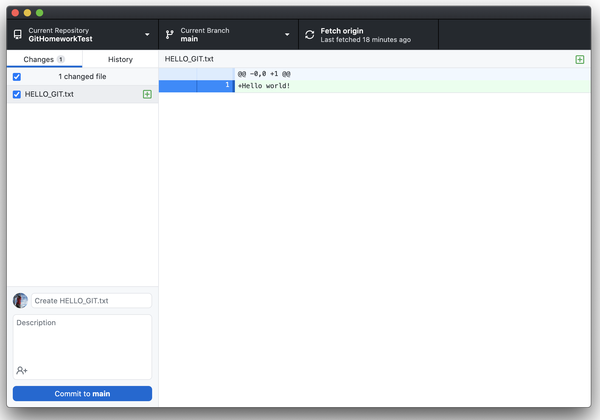
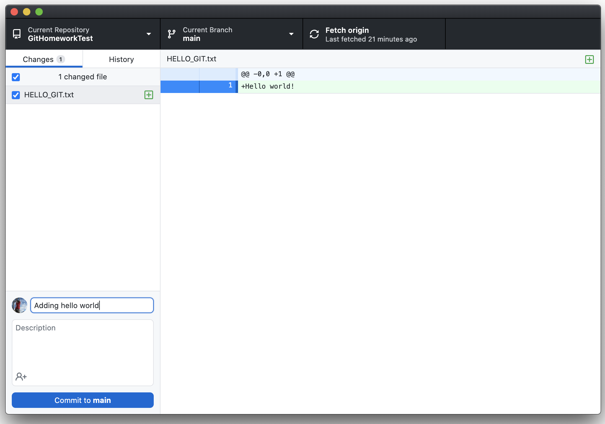
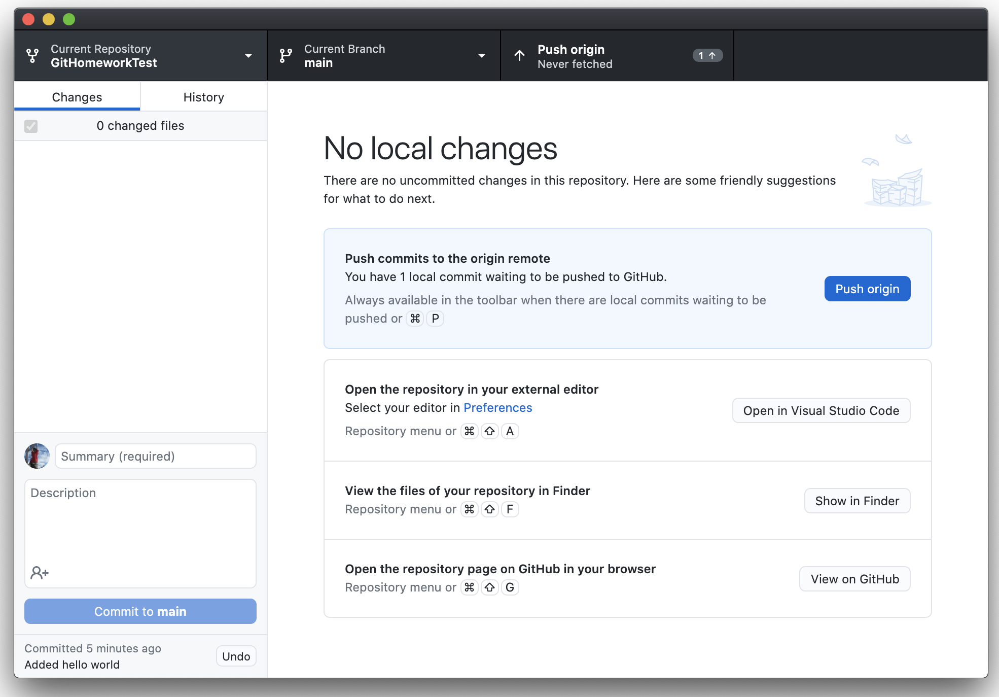
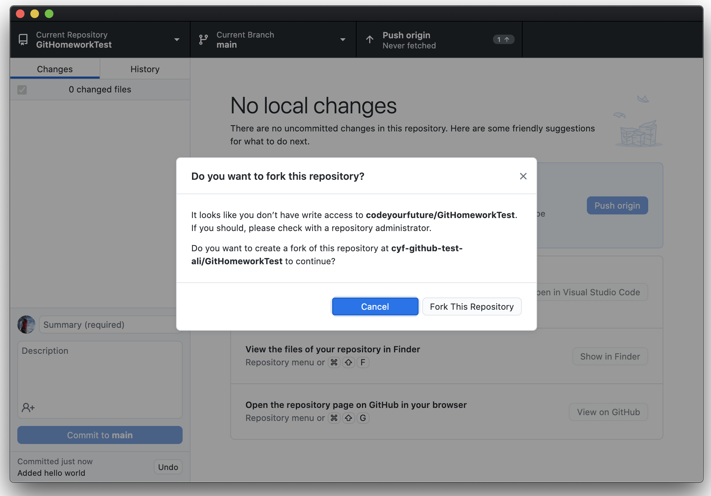
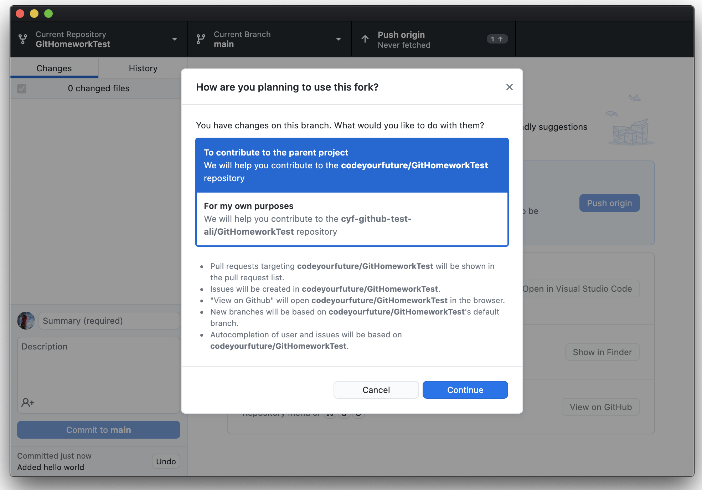
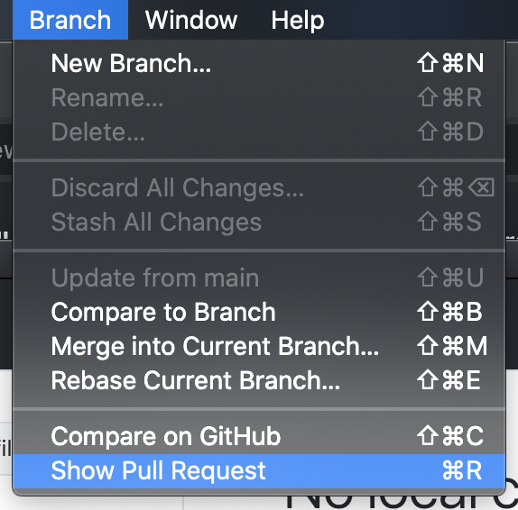
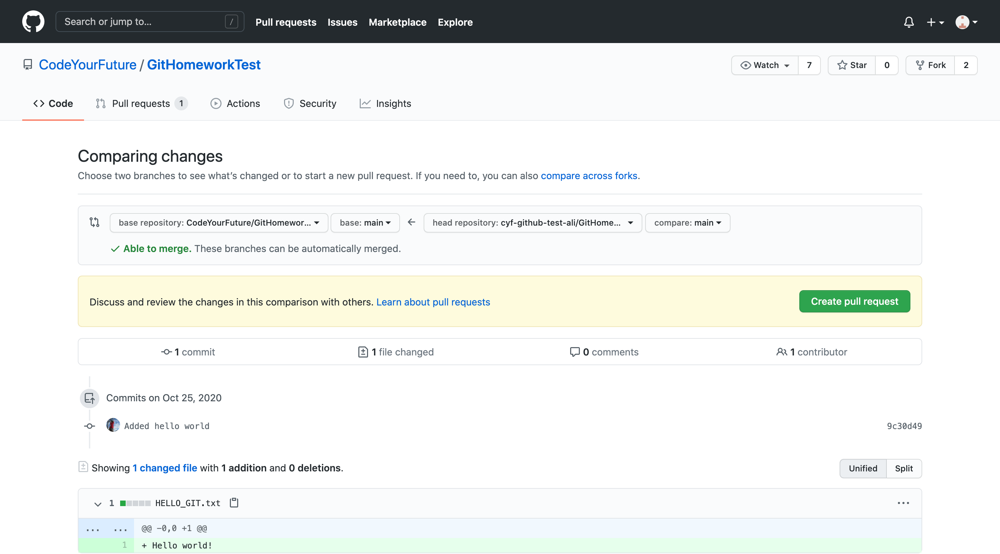
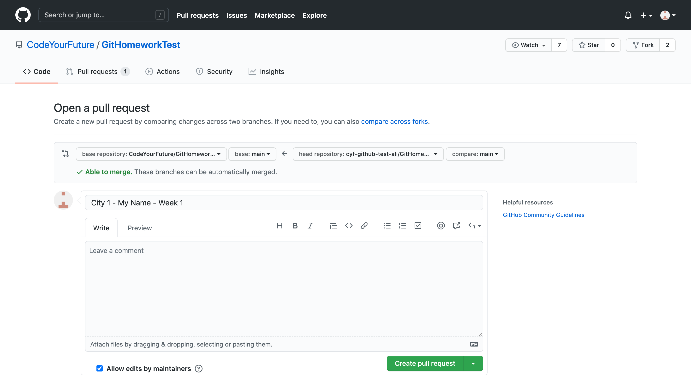

## I want to get code from a repo onto my computer (Cloning)

Follow these steps if you need to get code from a Github repo onto your computer (for example to complete your coursework).

:::info
Github Desktop might look a bit different if are cloning the first repository on your computer.
:::

#### Video

<video width="100%" controls>
  <source src={require('./assets/cloning-video.mp4').default} />
</video>

#### Screenshots

1. Open the repo on Github in your browser (for the coursework this will likely be https://github.com/CodeYourFuture/COURSEWORK_REPO_NAME):
2. Click the "Code" button, which opens a menu:

3. Copy the URL (Pro Tip: you can click the clipboard icon on the right to copy automatically!)
4. Open Github Desktop, and click on the Current Repository menu in the top left:

5. Click the Add button at the top, then the Clone Repository option:

6. In the Clone Repository modal, make sure you are on the URL tab. Then paste the URL that you copied before into the "URL or username/repository" input:

7. Click the Clone button, and wait until it has finished cloning

Congrats! You have successfully cloned a repo from Github! 🎉

## I want to open Visual Studio Code with code from my repo

Follow these steps if you already have the repo on your computer and you want to edit the files.

1. In the menubar, click the Repository option
2. Then click the Open in Visual Studio Code option:

Visual Studio Code will now open with the code from the repo.

## I want to save my code to the repo (Committing)

Follow these steps if you have edited some code, and want to update the repo with your changes.

#### Video

<video width="100%" controls>
  <source src={require('./assets/committing-video.mp4').default} />
</video>

#### Screenshots

1. Open Github Desktop and ensure you are in the correct Current Repository
2. A _diff_ showing the changes that you made is shown (lines with a green background were added, and lines with a red background were removed):

3. Click on the files in the sidebar to see different files. Make sure that you're only changing files that you meant to change
4. Once you're happy with your change, fill out the input boxes in the bottom left to add a _commit message_:

5. Click the "Commit to main" button

You just committed your code to the repo! 🎉

You should now see "No local changes". You can now make more changes to the repo (and more commits), or you can push your existing commits.

## I want to send my code to volunteers (Pushing)

Follow these steps if you have committed some code, and want to send it to the volunteers.

#### Video

<video width="100%" controls>
  <source src={require('./assets/pushing-video.mp4').default} />
</video>

#### Screenshots

1. Open Github Desktop and ensure you are in the correct Current Repository
2. Click the "Push origin" button at the top:

The next steps are different depending on whether this is the first time you have pushed this repo to Github. **If this is the first time you have pushed this repo, follow steps 3, 4 and 5 below. If not, you can skip those steps.**

3. If this is the first time you have pushed this repo, a message pops up asking if you want to _fork_ this repository. Click the Fork this Repository button:

4. A new message then pops up asking how you are planning to use the fork. Click the "To contribute to the parent project" option, then click Continue:

5. Click the "Push origin" button again

6. In the menubar, click the Branch > Show Pull Request option:

7. This will open a tab in your browser. Click the "Create pull request" button on the right:

8. Fill out the Pull Request title (it is helpful to include your city, name and which week the coursework is for):

9. Click the "Create pull request" button

Congrats! You just created a Pull Request on Github! 🎉

The volunteers will now be able to review your code and give feedback!

## TODO

- Decide what to do about the UI being different for the first repo
- Tips on writing a good commit message?
- Tips on understanding a diff?
