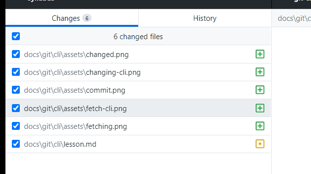
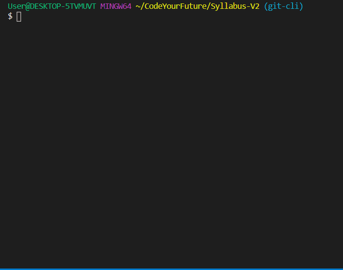

Everything that you're going to be doing using Git CLI you can also do using Github Desktop. Let's run through a few example of this

### Viewing Changed Files

To view the files that you have changed you can use

```sh
git status
```

This will show a list of files that have changed since the last time that you committed.

| Github Desktop                                                 | Git CLI                                                      |
| -------------------------------------------------------------- | ------------------------------------------------------------ |
|  |  |

### Including Files to Commit

One key different between Github Desktop and Git CLI is that you need to set which files will be committed to your repository. You can add files to be committed by using

```sh
git add .
```

This command will add **every** file you have changed to be ready to commit

| Github Desktop                                      | Git CLI                                                          |
| --------------------------------------------------- | ---------------------------------------------------------------- |
|  |  |

### Committing Changes

Committing changes to your repository can be done by using this command

```sh
git commit -m "YOUR MESSAGE HERE"
```

The `-m` means that after you are going to write your commit message.

| Github Desktop                                               | Git CLI                                             |
| ------------------------------------------------------------ | --------------------------------------------------- |
|  |  |

### Pushing Changes to Github

Finally, pushing your changes to Github can be completed by using

```
git pull
```

| Github Desktop                                 | Git CLI                                             |
| ---------------------------------------------- | --------------------------------------------------- |
|  |  |

### Fetching

To check if there have been any changes on Github you can use

```sh
git fetch
```

| Github Desktop                                     | Git CLI                                      |
| -------------------------------------------------- | -------------------------------------------- |
|  |  |
