This is the first part of more courses to come about accessibility.

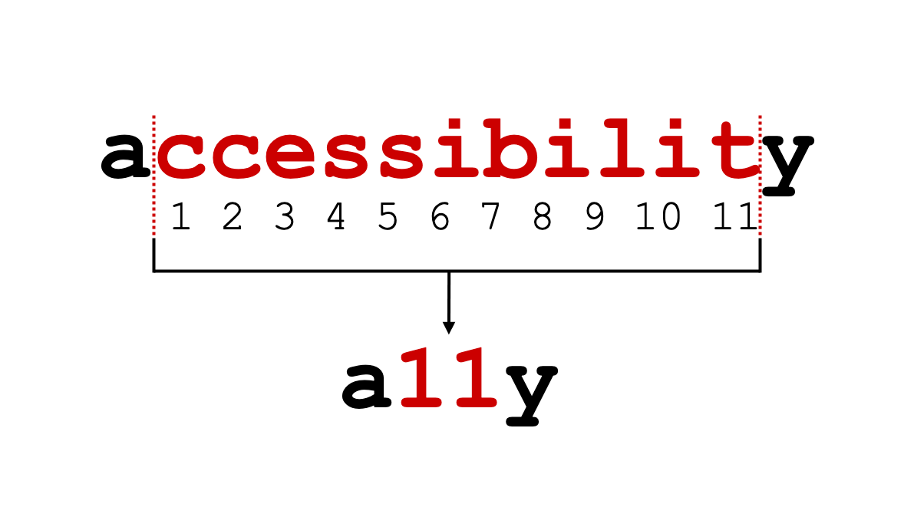

## Projected Time

- Lesson: 80 minutes
- Exercises: 40 minutes

## Prior Knowledge

Here are areas that you will need to have before starting this training. Students should have

- No prior knowledge needed

## Motivation

It is important to learn about this because

- Students should understand why considering accessibility is important when they are working
- Many employers will look for an understanding of common accessibility patterns
- We should all endeavour to make websites that everyone can use

## Learning Objectives

Participants will be able to:

- List the 4 main groups of disabilities (visual, hearing, motor, cognitive)
- Define what accessibility is
- Recall some specific conditions for each categories
- Define what an invisible disability is and give some examples
- Define situations where you can experience an accessibility issue, for touch, see, hear and speak or a combination of more than one of them (could be done as coursework)
- List some reasons why accessibility is important to consider
- Illustrate what each letter in SCULPT mean
- Apply advice to check colours and give good text links and alt texts
- Create an alternative text when sharing photo on social media.
- Identify good and bad practice in social media
- List the 4 principles of WCAG and define them in their own words
- Recall the 3 conformance levels and which one to aim for
- Identify situations where respecting the guidelines is not enough for a good user experience

## Video

<iframe width="560" height="315" src="https://www.youtube.com/embed/l0xBsR5mIYs" frameborder="0" allow="accelerometer; autoplay; encrypted-media; gyroscope; picture-in-picture" allowfullscreen></iframe>

## Presentation

You can find the slides for this presentation [here](https://docs.google.com/presentation/d/1CY7r_r8Zs6evWuQpGZK_E2zvXqNWbEEd5x5n1OhE6Rg/edit#slide=id.g8cddb4d8db_0_1).

<iframe src="https://docs.google.com/presentation/d/e/2PACX-1vSv1OxAdzvqH2PpEi0LiGhtio4ZDEyjAudNZpbRnDxmnsG8L6TqMgE1GFt7z2aMyyKc7KQwaZA8y2k2/embed?start=false&loop=false&delayms=3000" frameborder="0" width="560" height="315" allowfullscreen="true" mozallowfullscreen="true" webkitallowfullscreen="true"></iframe>

---

## Coursework

### Quiz (5 minutes)

Complete this [short quiz](https://forms.gle/atbcKQkeXZVwwTbRA) to show your understanding

### Screen Readers (20 minutes)

Try using your phone with the screen reader function.

- [How to use a screen reader on iOS](https://support.apple.com/en-us/HT210417)
- [How to use a screen reader on an Android phone](https://support.google.com/accessibility/android/answer/6006564?hl=en)

### How People Use Tech (20 minutes)

Read about using a switch

[24a11y.com/2018/i-used-a-switch-control-for-a-day](https://www.24a11y.com/2018/i-used-a-switch-control-for-a-day/)

Watch some of the videos on this page to understand more about how people with disabilities use tech.

[axesslab.com/tech-youtubers](https://axesslab.com/tech-youtubers/)

---

## Workshop

### Contents

- Different aspects of accessibility
  - Vision impairments
  - Hearing impairments
  - Motor impairments
  - Assistive devices
  - Cognitive impairments
  - Invisible disabilities
- Why it's important to consider
- How to make your social media posts accessible
- How to make your documents accessible
- WCAG (Web Content Accessibility Guidelines)

---

### Different aspects of accessibility

What is digital accessibility?

"Digital accessibility is the ability of a website, mobile application or electronic document to be easily navigated and understood by a wide range of users, including those users who have visual, auditory, motor or cognitive impairments."

**In the UK, 1 in 5 people are disabled**

The concept of accessibility doesn’t just apply to disabled people – all users will have different needs at different times and in different circumstances.

**Making things more accessible makes things better for all users.**

_"My needs are different from yours and my needs today might be different tomorrow”_ - Charles Hall

#### Vision impairments

In the UK: almost 2 million people living with sight loss.
360,000 are registered as blind or partially sighted.

**Blindness**: there is a legal definition which doesn’t imply seeing nothing at all. Many can read from a screen, but can’t use a mouse.

They often can’t see images, graphics or videos.

If the layout of your page, the navigation or labels of your fields are not clear, they won’t be able to use your website or app.

The main screen readers are:

- NVDA - it’s free
- JAWS - need a licence but good and have been here for a long time
- Voice Over

2 minutes video of a user (Kristy Viers) using an iPhone

<iframe width="560" height="315" src="https://www.youtube.com/embed/l0xBsR5mIYs" frameborder="0" allow="accelerometer; autoplay; encrypted-media; gyroscope; picture-in-picture" allowfullscreen></iframe>

#### People with low vision:

- Might need to magnify and miss some information if you don’t **align your content on the left** (for left to right languages, otherwise, align on the right)
- Might also miss some information if you don’t group related items together
- Need to be able to scroll both vertically and horizontally
- Can get lost in your page
- Might need to change colour contrast on their device or browser

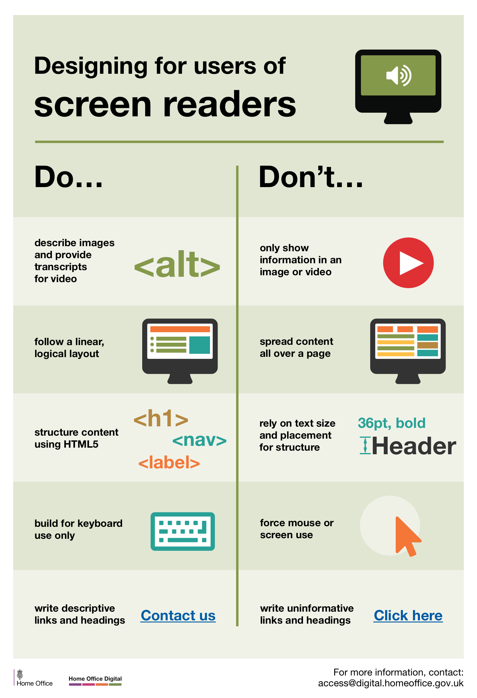
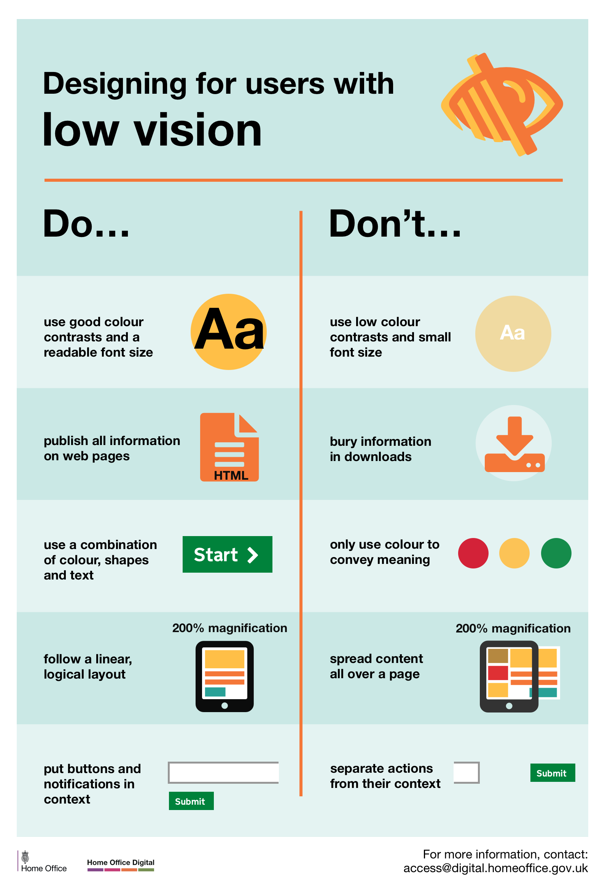
[Posters part of a set available here](https://github.com/UKHomeOffice/posters/blob/master/accessibility/dos-donts/posters_en-UK/accessibility-posters-set.pdf)

#### Colour blindness

People with colour vision deficiency find it difficult to identify and distinguish between certain colours.

Total colour blindness (an inability to see any colour) is very rare.

There are various types:

- Deuteranomaly: reduce sensitivity to green
- Protanopia: reduce sensitivity to red
- Tritanopia: reduce sensitivity to blue

For these people, information via colour alone won’t be understood or noticed.

For example, an error message in red with no other marks that something is wrong.

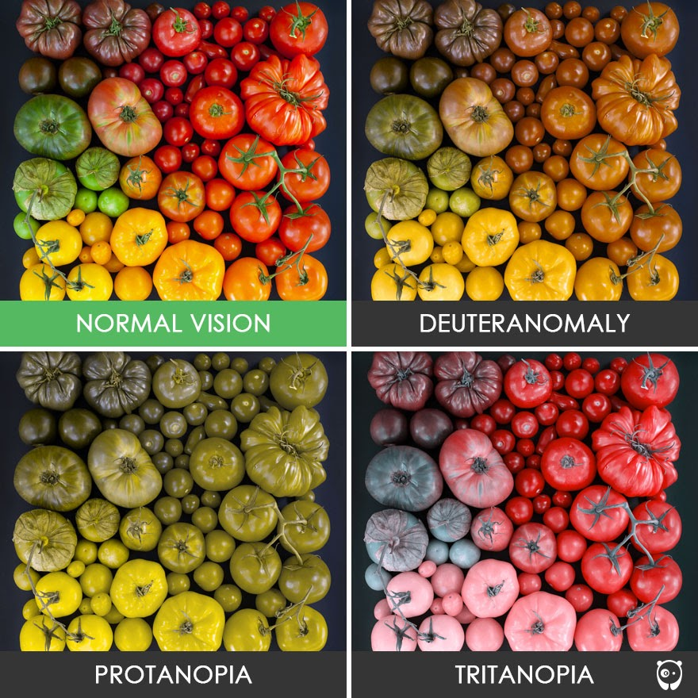

> **Exercise 1**:
>
> _Need about 10 minutes_
>
> Looking at this page: [Morrisons](https://groceries.morrisons.com/webshop/startWebshop.do)
> What do you think could be problematic for:
>
> - A person with low vision magnifying their screen by 4 (ctlr + to 400%)
> - A colour blind user
>
> Look at the pictures, the contrast, the colours
>
> Use Dev tool to emulate colour blindness:
> Go to console, then 3 dots menu, then rendering and then emulation at the bottom to see any page as a colour blind person would.

#### Hearing impairments

About **9 million people in the UK who are Deaf or hard of hearing**

- Any audio without subtitles or a transcript can be problematic
- Feedback only provided by a sound (bip or alert) won’t do
- English might not be their first language as they might be signing mostly
- Reading can be difficult for them
- When asked for a preferred contact method, they could be ok to receive text messages but not a phone call

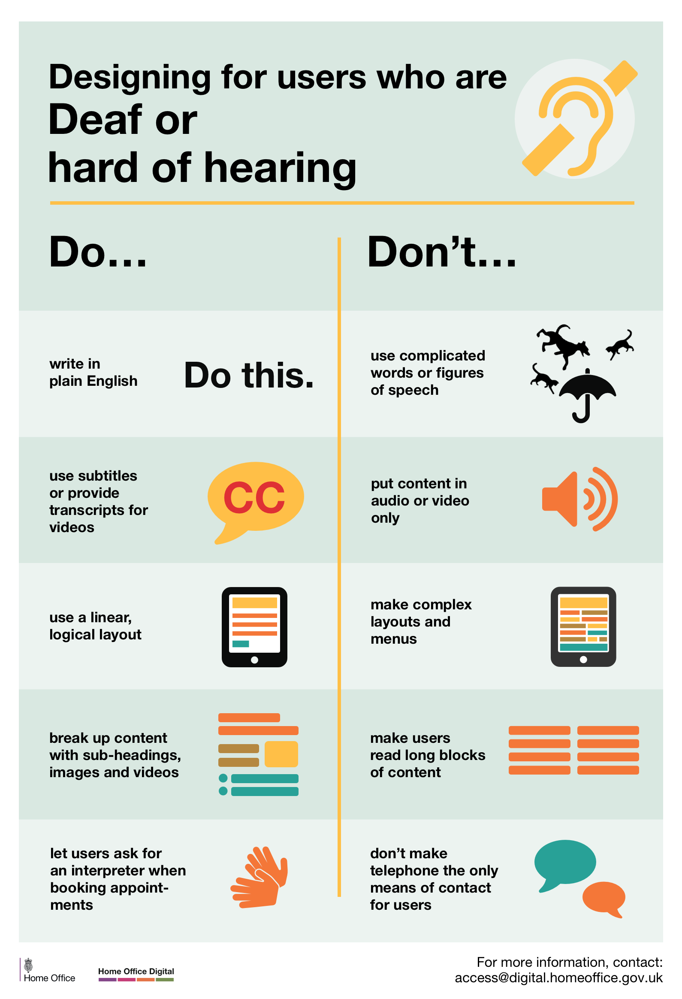
[Posters part of a set available here](https://github.com/UKHomeOffice/posters/blob/master/accessibility/dos-donts/posters_en-UK/accessibility-posters-set.pdf)

#### Motor impairments

It could be a missing limb, or a muscle control problem, spams, tremors or a lack of coordination.

Some potential problems:

- Using a mouse might be difficult
- Drag and drop can be hard to do
- Selecting a link too close to another
- Tapping a button if it’s too small of too close to another

#### Assistive devices

Some users might use a switch, a mouth-head stick keyboard or an assistive Joystick.

You can use voice activated software instead of typing. Some special keyboards can help you type.

All these assistive technologies can be expensive and create extra issues when used with other devices potentially.

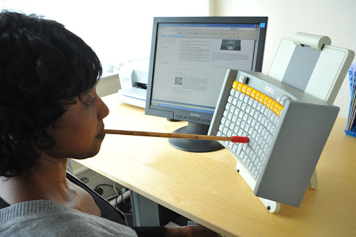

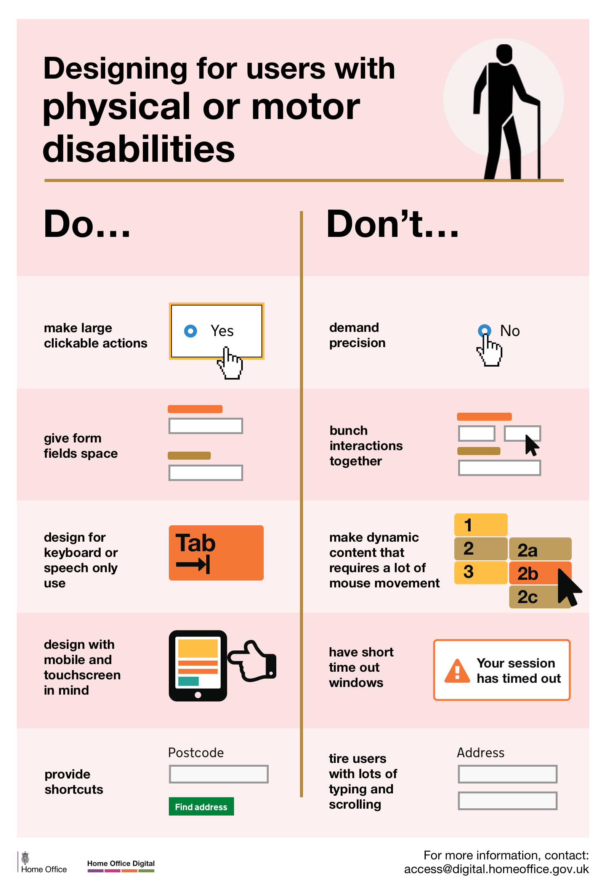
[Posters part of a set available here](https://github.com/UKHomeOffice/posters/blob/master/accessibility/dos-donts/posters_en-UK/accessibility-posters-set.pdf)

#### Cognitive impairments

Wide range of issues, some mild, some more severe, some can be punctual, and others permanent.

Dyslexia, autism, anxiety, dementia, Alzheimer, dyscalculia and dyspraxia for example.

This can affect the way you process information, your memory, your comprehension, your attention and the way you make decisions.

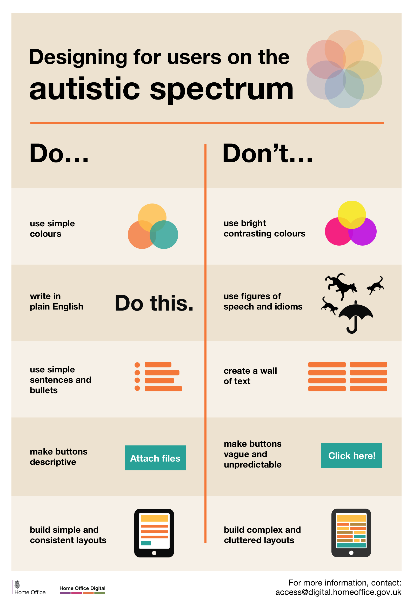
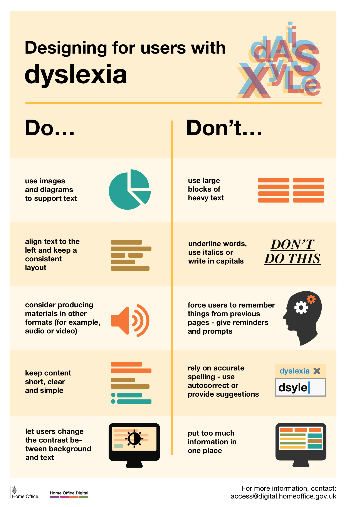
[Posters part of a set available here](https://github.com/UKHomeOffice/posters/blob/master/accessibility/dos-donts/posters_en-UK/accessibility-posters-set.pdf)

> **Exercise 2**:
>
> _About 10 minutes_
>
> Tab through a website (don’t use the mouse) and **find the phone number to contact someone** [you can use ASDA](https://www.asda.com/) for example.
>
> **Tab key** to move forward, **shift + tab** to move backward, **Enter** to select.
> You can also try to use one hand on your phone (if right handed, use the left and vice versa).
>
> Or simply try to start [Applying for a provisional driving licence](https://motoring.dvla.gov.uk/service/DvoConsumer.portal?_nfpb=true&_pageLabel=FAP&_nfls=false) on a mobile phone (their website is not responsive…)

#### Invisible disabilities

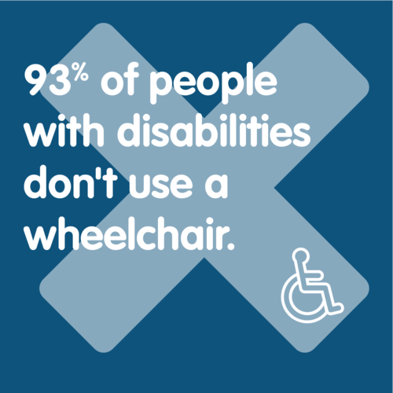

An invisible disability is a physical, mental or neurological condition that is not visible from the outside, yet can limit or challenge a person’s movements, senses, or activities.

**Symptoms can be**: debilitating pain, fatigue, dizziness, cognitive dysfunctions, learning differences, mental health disorders, or hearing and vision impairments for example.

**A wide range of conditions** like Fibromyalgia, Crohn’s disease, Multiple Sclerosis (M.S.), Autism, Anxiety, Myalgic Encephalomyelitis (M.E. also known as Chronic Fatigue Syndrome), Lupus, and many more…

In some cases, because it’s not obvious they have access needs, they can get questioned by people thinking they are abusing disabled parking places, use disabled toilets and more.

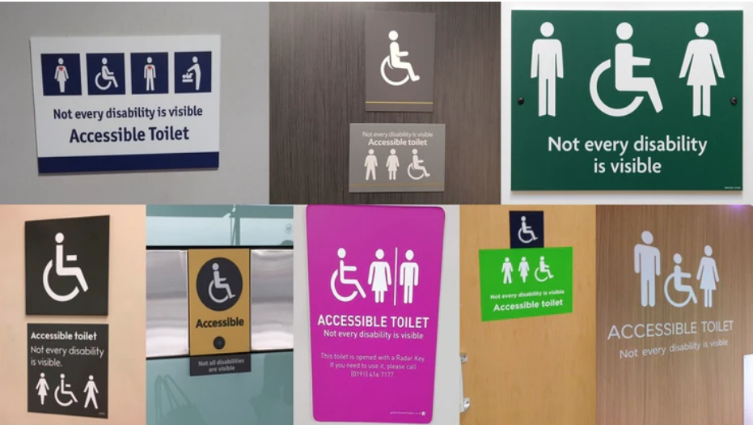

### Why it’s important to consider

**It can, and it will, affect everyone at some point in life**
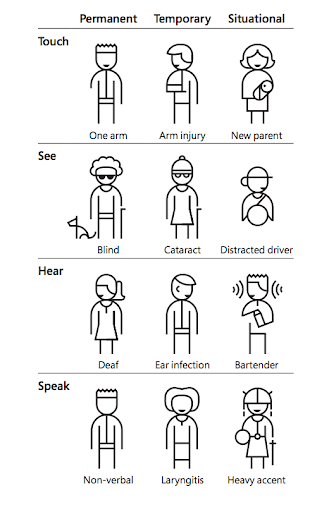

#### Legal requirements

- WCAG - Web Content Accessibility Guidelines
- UN Convention on the Rights of Persons with Disabilities
- Equalities Act 2010: anti discrimination legislation for the UK, The Public Sector Bodies (Websites and Mobile Applications)
- Accessibility Regulations 2018

#### Technical

It’s harder to ‘fix’ the accessibility after the development, so coding with accessibility in mind will reduce the development and maintenance time.
Your apps and websites will usually be more performant, (faster loading pages for example)

#### Financially

- Avoid legal cost
- No upgrade needed to add the accessibility issues after the release if you have been testing and considering accessibility all along

#### Reputation

As a company, it can be very damaging to neglect accessibility.
A huge number of people could be excluded from your product and they will voice their opinions on social media.

For example, a recent new feature on Twitter (short audio clip) didn’t consider hearing impaired people and visually impaired people.

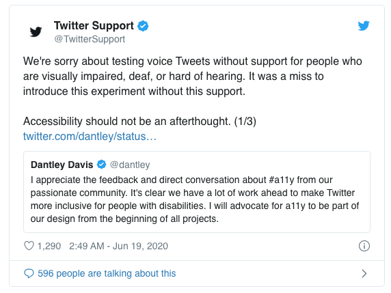

#### Why it’s important as a developer or a tester

As a future professional, it’s a good skill to have on your CV, employers are more and more aware of this. So if you have a portfolio, make sure it’s accessible.

You will be part of project teams. **Accessibility is everyone’s job**. If during a project you realise there is a potential accessibility issue (even non code related): Speak up!

Most of the accessibility problems will come from the way you coded a design, so you need to be aware of how you can avoid these.

### Make your social media posts accessible

#### Alt text - Alternative text

All your pictures (including diagrams) should have an Alt text which will be read by a screen reader for users who can’t see them.

Here how to do this:

- on [Twitter](https://help.twitter.com/en/using-twitter/picture-descriptions)
- on [Linkedin](https://www.linkedin.com/help/linkedin/answer/109799)
- on [Facebook](https://www.facebook.com/help/214124458607871)
- on [Instagram](https://help.instagram.com/503708446705527)

When you add a GIF, describe it [in square brackets]

#### Capitalise your Hashtags

Capitalising the 1st letter of each word on hashtags improves readability for screen readers.

For example: **#ThisIsHowtoFormatAnAccessibleHashtag**

#### Caption your videos and multimedia

<iframe width="560" height="315" src="https://www.youtube.com/embed/LCZ-cxfxzvk" frameborder="0" allow="accelerometer; autoplay; encrypted-media; gyroscope; picture-in-picture" allowfullscreen></iframe>

#### Emoji

Try not to use them too much. They are read aloud by screen readers.

For example: :smiley:  
would become “smiley face emoji”.

Don’t put them in your Twitter display name, they will be read each time.

#### Hashtags and mentions go at the end

The symbols # and @ are said aloud by screen readers, so it makes it harder to understand your post.
Add them after your text. It will be clearer.

#### Avoid all caps words and text

It’s harder for everyone to read.

The ‘shape’ of a word helps us to identify it and this is lost with capitals.

It can be misinterpreted by screen readers as well.

**DON'T DO THIS, IT'S HARDER TO READ**

> **Exercise 3**:
>
> _About 10 minutes_
>
> Post something on social media with a photo, add an alternative text.
>
> Scroll through your timeline and look for:
>
> - Well formatted hashtags
> - Images with alt text
> - Videos with subtitles

#### More on the subject

[Guidance by the government to do a good social media campaign](https://gcs.civilservice.gov.uk/guidance/digital-communication/planning-creating-and-publishing-accessible-social-media-campaigns/)

### Make your document accessible

You never know who will read a document, so make it accessible. It’s better for everyone anyway.
[SCULPT is a framework with some basic advice created by Worcestershire Council](https://www.worcestershire.gov.uk/WCCSculpt)

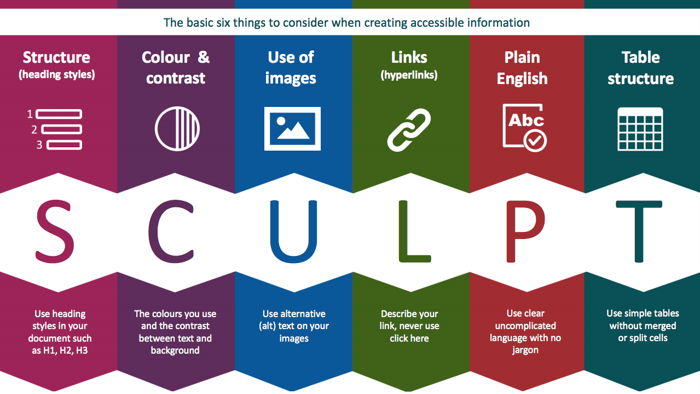

#### Structure

**Follow the heading styles in your document**, don’t just use bold and bigger fonts as it won’t make any difference to a screen reader user.

**Align** your text and components **on the left** and **don’t justify your text**, it’s easier to read and easier to find when magnified.

#### Colour and contrast

Consider the colours you use to make sure the contrast is good enough between the text and the background.

You can use this tool for example to check: [accessible-colors.com](https://accessible-colors.com/)

**Remember to never use colour only to convey something.**

#### Use alternative text

(alt) text on your images do describe them to people who might not see them. This will be read by the screen reader.

#### Links

Describe what the link does, where it takes you, never just use ‘click here’ .

Don’t use ‘Click’ because it’s device specific, your user might be on a mobile and ‘tap’ instead. You can use ‘select’ or ‘follow’ for example.

#### Plain language

Use clear and uncomplicated language with no jargon, if you are using complex terms or acronyms, explain them first.

#### Links

Use simple tables without merged or split cells, they are easier to follow.

> **Exercise 4**:
>
> _About 10 minutes_
>
> [Visit this page](https://bellatory.com/hair/DIY-Haircut-3-Styles)
>
> - **Write an alternative text** (alt text for some pictures) on this page
> - **Check colours contrast** on that page using the link mentioned above: [accessible-colors.com](https://accessible-colors.com/)
> - **Critic text links** on this website: [metoffice.gov.uk/weather/learn-about/weather/seasons/summer/10-facts-about-summer](https://www.metoffice.gov.uk/weather/learn-about/weather/seasons/summer/10-facts-about-summer)
> - Think of a better text links where possible

### WCAG (Web Content Accessibility Guidelines)

#### Massive document, not easy to read

WCAG is a long list of standards for web content accessibility: [the WCAG guidelines](https://www.w3.org/WAI/WCAG21/Understanding/)

Last version is version 2.1 (since 2018)
3 conformance levels: A , AA and AAA.
A is the minimum, you need to aim for at least AA

The last update focussed on improving the guidance for:

- Cognitive and learning disabilities
- Low vision
- Using mobile devices

#### 4 principles of accessibility: P.O.U.R.

**Perceivable** - Information and user interface components must be presentable to users in ways they can perceive.

> Information being presented can't be invisible to all of the user’s senses.

**Operable** - User interface components and navigation must be operable.
The interface cannot require interaction that a user cannot perform.

**Understandable** - Information and the operation of user interface must be understandable.

> The content or operation cannot be beyond the users’ understanding.

**Robust** - Content must be robust enough that it can be interpreted reliably by a wide variety of user agents, including assistive technologies.

> As technologies evolve, the content should remain accessible to users, including those using assistive technologies.

Like any standards and guidelines, remember it’s not just about meeting them from a legal point of view but also in a way that works for the people.

##### Bad examples:

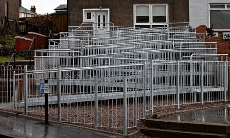

#### Don’t just follow the guidelines, test with users

The touch targets area are big enough and respect WCAG recommendations, but a user with tremor (Parkinson) was struggling.

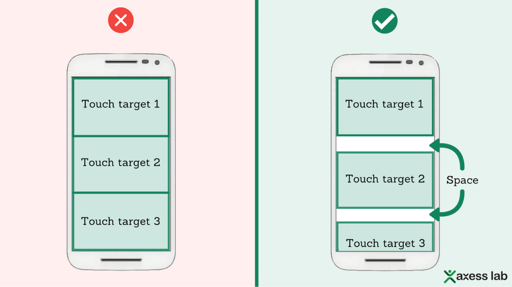

Help to use your current location instead of having to type it. This is compliant with WCAG and helps users, but not screen readers users.

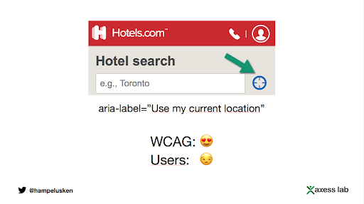

#### More on WCAG Guidelines

- WCAG2.1: [w3.org/WAI/WCAG21/Understanding](https://www.w3.org/WAI/WCAG21/Understanding/)
- Webaim: [webaim.org/standards/wcag/checklist](https://webaim.org/standards/wcag/checklist)
- W3C: [w3.org/TR/WCAG21](https://www.w3.org/TR/WCAG21/)
- WCAG2.1, [checklist from the GOV.UK](https://alphagov.github.io/wcag-primer/checklist.html#perceivable)

### What next?

- Start applying them in everything you do
- On twitter or other social media, connect or follow diverse people so you can learn from what they share
- Go to accessibility meet-ups, we will post them on Slack
- There will be another course, more specific about **making your code accessible as a developer**
- You won’t get it right every time, but you learn and do better next time
